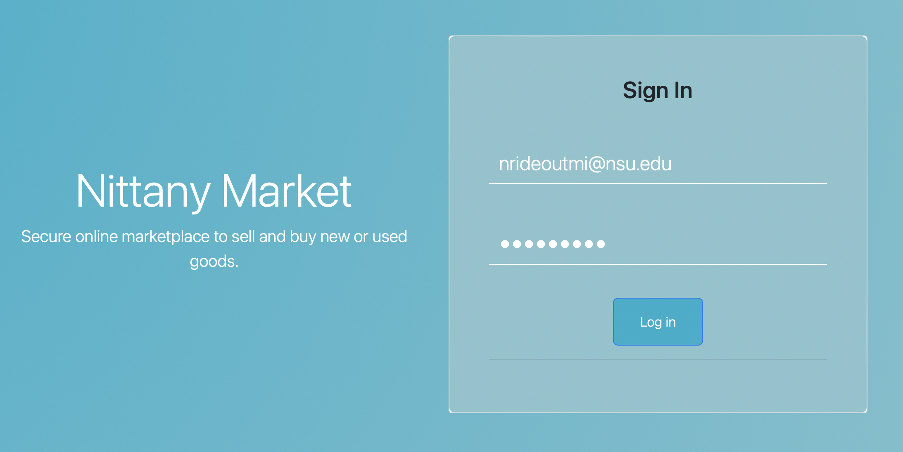
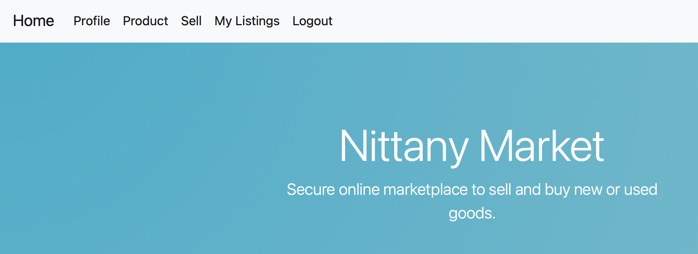
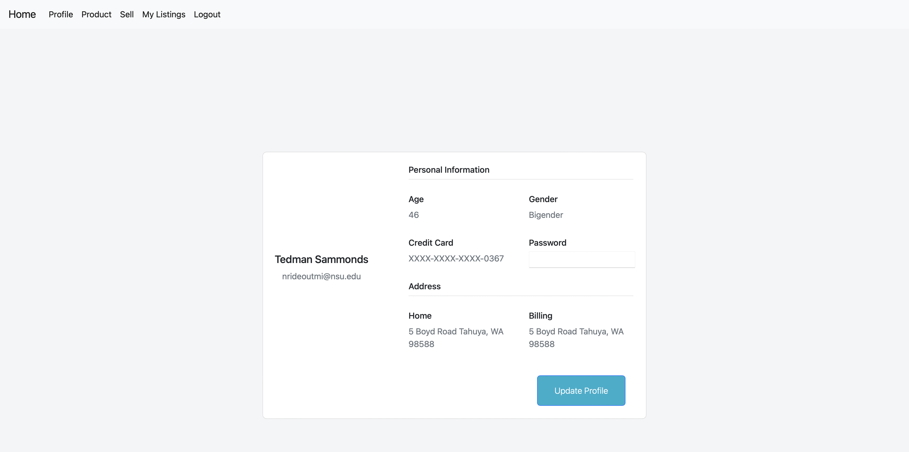
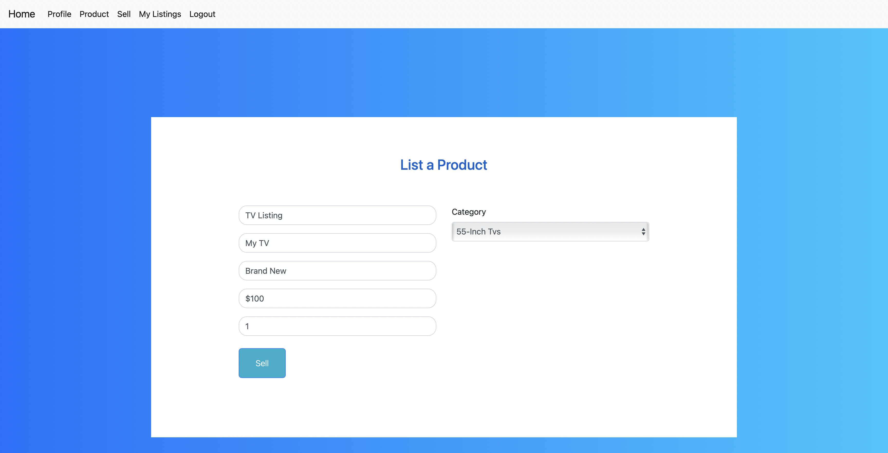

# Nittany Market
<table>
    <tr>
<td>
   Website where Nittany State University members and local businesses can buy and sell goods.
</td>
</tr>
</table>

## Database
* Database: SQLite
* User's passwords are hashed using Python's hashlib library.

## Functionalities
### User Login Page

* Users can login with their email and password
* Users' login information is pre-stored in the database
* If User enters email not in the format of email, it will display "Enter an email address" message
* If email and password are correct, User will be redirected to Home Page
* If email and password are incorrect, "Incorrect email or password" message will be displayed and User will stay on Login Page
### Home Page

* The main page has a navigation bar at the top of the page
* Clicking on the navigation bar will take you to the corresponding page
* The navigation bar has the following options:
    * Home - brings you to the Home Page
    * Profile
    * Sell
    * My Listings
    * Logout - bring you back to the Login Page
### Profile Page

* Displays the user's information: name, email, age, gender, last 4 digits of credit card, home address and billing address
* Users can update their password by entering their new password in textbox then click update profile button
### Products Page

* Products page initially displays all products in the database
* Users can filter products by category by selecting a category from the dropdown menu and clicking the submit button
  * From there users can further filter products by their subcategory by selecting a subcategory from the dropdown menu and clicking the submit button
### Sell Page

* Sellers can list a product by filling out the form and clicking submit
* The form has the following fields:
    * Title
    * Product Name
    * Product Description
    * Price
    * Quantity
    * Category
* Clicking submit brings the user to Products Page
### My Listings Page

* Displays all products that the user has listed
* Users can delete a product by clicking the delete button
